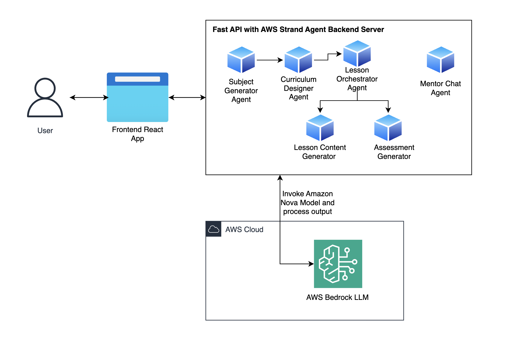
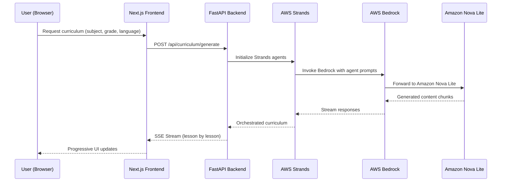

# graspy

AI-powered educational platform for personalized, multi-language curriculum generation using AWS Bedrock and Strands.


> **📚 For project vision, roadmap, and detailed information, see [docs/OVERVIEW.md](docs/OVERVIEW.md)**

---

## 📦 Project Structure

Graspy is built as an **npm workspace** monorepo, containing two main applications:

```
graspy/
├── apps/
│   ├── web/                    # Next.js frontend application
│   └── server/                 # Python FastAPI backend 
```

### Architecture Diagram



#### Data Flow



---


## 🚀 Local Setup & Installation

### Prerequisites

Before you begin, ensure you have the following installed:

| Tool | Version | Installation |
|------|---------|--------------|
| **Node.js** | >= 18.0.0 | [Download](https://nodejs.org/) |
| **npm** | >= 10.9.2 | Comes with Node.js |
| **Python** | >= 3.12 | [Download](https://www.python.org/) |
| **uv** | Latest | `pip install uv` or [Install Guide](https://docs.astral.sh/uv/getting-started/installation/) |

---

### Step 1: Clone the Repository

```bash
git clone https://github.com/tosinamuda/graspy.git
cd graspy
```

---

### Step 2: Install Dependencies

Since this is an **npm workspace monorepo**, install from the root directory:

```bash
npm install
```


**Note:** The Python backend uses `uv` for dependency management, which is automatically called during `npm install` via the `preinstall` script in `apps/server/package.json`.

---

### Step 3: Configure Environment Variables

Both the frontend and backend require environment variables to run properly.

#### 🔧 Backend Configuration (`apps/server/`)

1. **Copy the example environment file:**

```bash
cd apps/server
cp .env.example .env
```

2. **Edit `.env` with your credentials:**

```bash
# Required for local development
nano .env  # or use your preferred editor
```

**Minimum Required Configuration:**

```env
# ============================================================
# Server Configuration
# ============================================================
HOST=0.0.0.0
PORT=8081
UVICORN_RELOAD=true

# ============================================================
# AWS Bedrock Configuration (REQUIRED)
# ============================================================
BEDROCK_AWS_REGION=us-east-1
BEDROCK_AWS_ACCESS_KEY_ID=your_aws_access_key_here
BEDROCK_AWS_SECRET_ACCESS_KEY=your_aws_secret_key_here

# ============================================================
# Strands AI Configuration
# ============================================================
STRANDS_MODEL_ID=amazon.nova-lite-v1:0
STRANDS_TEMPERATURE=0
STRANDS_STREAMING=true

# ============================================================
# Lesson Configuration
# ============================================================
LESSON_SLIDE_MAX_TOKENS=9000
LESSON_PRACTICE_MAX_TOKENS=5000
```


#### 🌐 Frontend Configuration (`apps/web/`)

1. **Copy the example environment file:**

```bash
cd apps/web
cp .env.example .env.local
```

2. **Edit `.env.local`:**

```bash
nano .env.local  # or use your preferred editor
```

**Configuration:**

```env
# API endpoint for backend (development)
NEXT_PUBLIC_API_URL=http://localhost:8081/api
```

**For production deployment:**

```env
# Production API endpoint
NEXT_PUBLIC_API_URL=https://your-production-api.com/api
```

---

### Step 4: Run the Application

#### 🚀 Option 1: Run Everything Together (Recommended)

From the **root directory**, start both frontend and backend:

```bash
npm run dev
```

This uses **Turborepo** to run both applications concurrently:

- ✅ **Frontend**: [http://localhost:3000](http://localhost:3000) - Next.js with Turbopack
- ✅ **Backend**: [http://localhost:8081](http://localhost:8081) - FastAPI with uvicorn


#### 🔨 Option 2: Run Apps Individually

**Frontend only:**

```bash
cd apps/web
npm run dev
```

Access at: [http://localhost:3000](http://localhost:3000)

**Backend only:**

```bash
cd apps/server
npm run dev
```

Access at: [http://localhost:8081](http://localhost:8081)


#### 📦 Production Build

To build for production:

```bash
# Build all apps
npm run build

# Start production servers
npm run start
```

**Production Ports:**
- Frontend: [http://localhost:3000](http://localhost:3000)
- Backend: [http://localhost:8081](http://localhost:8081)

---

### Step 5: Verify Installation

Once everything is running, verify the setup:

1. **Open your browser**: Go to [http://localhost:3000](http://localhost:3000)
2. **You should see**: The Graspy homepage 
3. **Test the backend**: Go to [http://localhost:8081/docs](http://localhost:8081/docs) to see the FastAPI interactive docs
4. **Create a curriculum**: Select a subject and try generating a curriculum to verify AI integration

---

## 📚 API Documentation & Useful Links

### Backend API Endpoints

| Endpoint | Method | Description |
|----------|--------|-------------|
| `/api/health` | GET | Health check |
| `/api/curriculum/generate` | POST | Generate personalized curriculum (SSE stream) |
| `/api/curriculum/chat` | POST | Chat with AI tutor about curriculum |
| `/api/lesson/{topicIndex}` | GET | Get specific lesson content |

### Frontend Routes

| Route | Description |
|-------|-------------|
| `/` | Marketing Homepage |
| `/app` | App Landing Page |
| `/app/onboarding` | App Onboarding Page |
| `/app/learn` | Student Learning Dashboard |


---

## 📄 License

This project is licensed under the ISC License.

---

## 📚 Additional Documentation

- **Project Vision & Roadmap**: [docs/OVERVIEW.md](docs/OVERVIEW.md)

---

