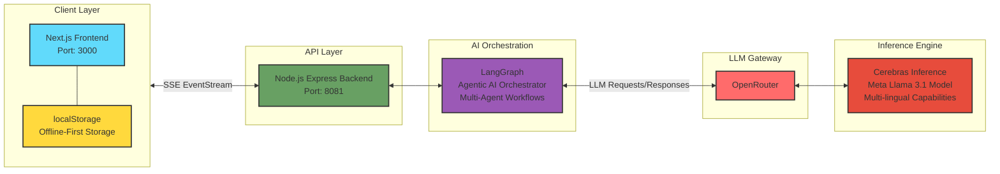

# graspy - AI Tutor for Out-of-School Children

<div align="center">

**Providing personalized, culturally-aware education to 244 million out-of-school children in crisis zones, IDP camps, and underserved communities worldwide.**

[](https://www.wemakedevs.org/hackathons/futurestack25) [](https://nodejs.org) [](https://docs.npmjs.com/cli/v7/using-npm/workspaces)

</div>

---

## 📖 Overview

graspy is an AI-powered educational platform designed to deliver quality education to displaced and underserved children worldwide. The platform generates personalized learning curricula adapted to each student's native language, cognitive level, and cultural context—ensuring that education remains accessible even in the most challenging circumstances.

**Key Features:**

- 🌍 **Multi-language Support**: Native language learning (Arabic, Hausa, Yoruba, Pashto, etc.)
- 🎯 **Adaptive Curriculum**: AI-generated personalized learning paths using LangGraph
- 📚 **Culturally Relevant**: Context-aware examples (local currency, food, scenarios)
- 💬 **AI Tutor Chat**: Real-time Q&A with Socratic teaching methods
- 📊 **Progress Tracking**: Mastery-based learning with detailed analytics
- 🔌 **Offline-First**: Local storage for continued learning without internet
- ♿ **Accessible**: Mobile-first design with RTL language support

---

## 🎯 Why Graspy?

**The Problem:**

- 244 million children are out of school globally
- Crisis zones, IDP camps, and underserved communities lack educational infrastructure
- Traditional one-size-fits-all curricula don't account for displaced children's varied educational backgrounds
- Language barriers prevent learning in unfamiliar languages
- Intermittent internet access in crisis zones

**Our Solution:**

- AI-powered personalized curriculum generation
- Culturally and linguistically appropriate content
- Offline-first architecture for unreliable connectivity
- Free, accessible education for all
- Adaptive learning that meets students at their actual cognitive level

---

## 📦 Project Structure

Graspy is built as an **npm workspace** monorepo, containing two main applications:

```
graspy/
├── apps/
│   ├── web/                    # Next.js frontend application
│   └── server/                 # Express.js backend API
├── node_modules/               # Shared dependencies
├── package.json               # Workspace root configuration
├── turbo.json                 # Turborepo build configuration
└── README.md                  # This file
```

### Architecture Diagram



---

## 🛠️ Technology Stack

### Frontend ([apps/web/](apps/web/))

| Technology       | Purpose                                      |
| ---------------- | -------------------------------------------- |
| **Next.js**      | React framework with App Router & Turbopack  |
| **React**        | UI component library                         |
| **TypeScript**   | Type-safe development                        |
| **Tailwind CSS** | Utility-first styling                        |
| **next-intl**    | Internationalization (i18n) with RTL support |

**Location**: [`/apps/web/`](apps/web/)

### Backend ([apps/server/](apps/server/))

| Technology     | Purpose                                      |
| -------------- | -------------------------------------------- |
| **Express.js** | Node.js web framework                        |
| **TypeScript** | Type-safe backend                            |
| **LangGraph**  | AI workflow graphs for curriculum generation |

**Location**: [`/apps/server/`](apps/server/)

### AI & Inference

| Service        | Purpose                                       |
| -------------- | --------------------------------------------- |
| **OpenRouter** | Unified LLM API gateway                       |
| **Meta Llama** | Primary language model for content generation |
| **Cerebras**   | High-performance AI inference engine          |

### Development Tools

- **Turborepo**: Monorepo build orchestration
- **npm Workspaces**: Dependency management

---

## 🚀 Local Setup & Installation

### Prerequisites

```bash
Node.js >= 16.0.0
npm >= 10.9.2
```

### 1. Clone the Repository

```bash
git clone https://github.com/tosinamuda/graspy.git
cd graspy
```

### 2. Install Dependencies

Since this is an **npm workspace**, install from the root:

```bash
npm install
```

This will install dependencies for both `apps/web` and `apps/server`.

### 3. Environment Configuration

#### Backend Environment Variables
Copy sample enviornment variable from `.env.example` to `.env.development` in [`apps/server/config/`](apps/server/config/):

```bash
cd apps/server/config
cp .env.example .env.development
```

**How to get API Keys:**

1. **OpenRouter**: Sign up at [openrouter.ai](https://openrouter.ai) → Get API key
2. Create a `.env.development` file in `apps/server/config/`
3. Add your `OPENROUTER_API_KEY`


#### Frontend Environment Variables

Copy sample enviornment variable from `.env.example` to `.env` in [`apps/web/`](apps/web/):


Adjust the environment variable as you see fit 
**`.env.local`**:

```env
NEXT_PUBLIC_API_URL=http://localhost:8081
```

**`.env`** (for production):

```env
NEXT_PUBLIC_API_URL=https://your-production-api.com
```

### 4. Run the Application

#### Development Mode (Recommended)

From the **root directory**, run both apps concurrently:

```bash
npm run dev
```

This uses Turborepo to run:

- **Frontend**: [http://localhost:3000](http://localhost:3000) (Next.js with Turbopack)
- **Backend**: [http://localhost:8081](http://localhost:8081) (Express.js)

#### Run Apps Individually

**Frontend only:**

```bash
cd apps/web
npm run dev
```

**Backend only (hot-reload):**

```bash
cd apps/server
npm run dev:hot
```

#### Production Build

```bash
# Build all apps
npm run build

# Start production servers
npm run start
```


## 🤖 Integration Details

### How Graspy Used Hackathon Partner Services

#### 1. **Meta Llama Models** (via Langraph)

- **Purpose**: Multi-linguial Agentic curicullum generation
- **Models Used**:
  - `meta-llama/llama-4-scout` - Complex curriculum generation

#### 2. **OpenRouter**

- **Purpose**: LLM gateway to Cerebas API to access meta-llama 4

#### 3. **Cerebras Inference**

- **Purpose**: Ultra-fast inference for real-time chat
- **Integration**: Via OpenRouter's cerebras integration

#### 4. **Docker**

- **Purpose**: To containerize the frontend and backend application
  LangGraph orchestrates complex AI workflows:

---

## 🎓 Post-MVP Roadmap

### Phase 1: Enhanced Features (Q4 2026)

- [ ] User authentication
- [ ] More curriculum support
- [ ] Adaptive curriculum (AI-recommended remedial topics)
- [ ] Parent dashboard (read-only progress view)
- [ ] Study streak tracker
- [ ] Launch

### Phase 2: Platform Expansion (Q1 2026)

- [ ] Teacher dashboard with class management
- [ ] Peer-to-peer study groups
- [ ] Video content integration
- [ ] Mobile native apps (React Native)
- [ ] Voice input for chat (Web Speech API)

### Phase 3: Scale & Impact (Q2 2026)

- [ ] Offline content packages (USB distribution)
- [ ] SMS-based progress notifications
- [ ] Multi-modal learning (audio lessons)
- [ ] Gamification and achievements
- [ ] Partnership with NGOs and UNHCR

### Long-term Vision

- **1M+ Students**: Reach 1 million displaced children by 2026
- **50+ Languages**: Expand to all major languages in crisis zones
- **Offline Mesh Networks**: Peer-to-peer content sharing via Bluetooth/WiFi Direct
- **AI Voice Tutors**: Multi-lingual voice-based tutoring
- **Credential Pathways**: Recognized certificates for students
