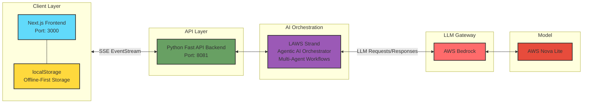
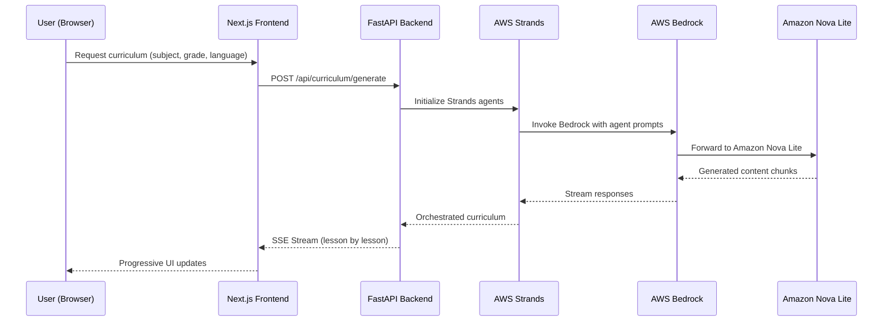

# graspy - AI Tutor for Out-of-School Children

<div align="center">

**Providing personalized, culturally-aware education to 244 million out-of-school children in crisis zones, IDP camps, and underserved communities worldwide.**

[](https://nodejs.org) [](https://docs.npmjs.com/cli/v7/using-npm/workspaces)

</div>

---

## 📖 Overview

graspy is an AI-powered educational platform designed to deliver quality education to displaced and underserved children worldwide. The platform generates personalized learning curricula adapted to each student's native language, cognitive level, and cultural context—ensuring that education remains accessible even in the most challenging circumstances.

**Key Features:**

- 🌍 **Multi-language Support**: Native language learning (Arabic, Hausa, Yoruba, Pashto, etc.)
- 🎯 **Adaptive Curriculum**: AI-generated personalized learning paths using Agentic AI through AWS Strands
- 📚 **Culturally Relevant**: Context-aware examples (local currency, food, scenarios)
- 💬 **AI Tutor Chat**: Real-time Q&A with Socratic teaching methods
- 🔌 **Offline-First**: Local storage for continued learning without internet
- ♿ **Accessible**: Mobile-first design with RTL language support

---

## 🎯 Why Graspy?

**The Problem:**

- 244 million children are out of school globally
- Crisis zones, IDP camps, and underserved communities lack educational infrastructure
- Traditional one-size-fits-all curricula don't account for displaced children's varied educational backgrounds
- Language barriers prevent learning in unfamiliar languages
- Intermittent internet access in crisis zones

**Our Solution:**

- AI-powered personalized curriculum generation
- Culturally and linguistically appropriate content
- Offline-first architecture for unreliable connectivity
- Free, accessible education for all
- Adaptive learning that meets students at their actual cognitive level

---

---

## 📦 Project Structure

Graspy is built as an **npm workspace** monorepo, containing two main applications:

```
graspy/
├── apps/
│   ├── web/                    # Next.js frontend application
│   │   ├── src/                # Source code
│   │   │   ├── app/            # Next.js App Router pages
│   │   │   ├── components/     # React components
│   │   │   ├── lib/            # Utility functions & API clients
│   │   │   └── locales/        # i18n translation files (en, ar, yo)
│   │   ├── .env.example        # Environment variables template
│   │   └── package.json        # Frontend dependencies
│   │
│   └── server/                 # Python FastAPI backend
│       ├── app/                # Application code
│       │   ├── api/            # API routes
│       │   ├── services/       # Business logic & AI agents
│       │   ├── schemas.py      # Pydantic models
│       │   ├── settings.py     # Configuration management
│       │   └── main.py         # FastAPI app entry point
│       ├── .env.example        # Environment variables template
│       ├── main.py             # Server entry point
│       ├── pyproject.toml      # Python dependencies
│       └── package.json        # npm scripts wrapper
│
├── node_modules/               # Shared dependencies
├── package.json               # Workspace root configuration
├── turbo.json                 # Turborepo build configuration
└── README.md                  # This file
```

### Architecture Diagram



---

## 🛠️ Technology Stack

### Frontend ([apps/web/](apps/web/))

| Technology       | Purpose                                      |
| ---------------- | -------------------------------------------- |
| **Next.js**      | React framework with App Router & Turbopack  |
| **React**        | UI component library                         |
| **TypeScript**   | Type-safe development                        |
| **Tailwind CSS** | Utility-first styling                        |
| **next-intl**    | Internationalization (i18n) with RTL support |

**Location**: [`/apps/web/`](apps/web/)

### Backend ([apps/server/](apps/server/))

| Technology                   | Purpose                                        |
| ---------------------------- | ---------------------------------------------- |
| **FastAPI**                  | Modern Python web framework with async support |
| **Pydantic**                 | Data validation and settings management        |
| **Python 3.12+**             | Programming language                           |
| **uv**                       | Fast Python package manager                    |
| **AWS Strands**              | AI agent framework for curriculum generation   |
| **SSE (Server-Sent Events)** | Real-time streaming responses                  |

**Location**: [`/apps/server/`](apps/server/)

### AI & Inference

| Service           | Purpose                                       |
| ----------------- | --------------------------------------------- |
| **AWS Bedrock**   | LLM Inferencing                               |
| **AWS Nova Lite** | Primary language model for content generation |
| **AWS Strand**    | Agentic AI framework for orchestrating agents |

### Development Tools

- **Turborepo**: Monorepo build orchestration
- **npm Workspaces**: Dependency management

---

## 🚀 Local Setup & Installation

### Prerequisites

Before you begin, ensure you have the following installed:

| Tool        | Version   | Installation                                                                                 |
| ----------- | --------- | -------------------------------------------------------------------------------------------- |
| **Node.js** | >= 18.0.0 | [Download](https://nodejs.org/)                                                              |
| **npm**     | >= 10.9.2 | Comes with Node.js                                                                           |
| **Python**  | >= 3.12   | [Download](https://www.python.org/)                                                          |
| **uv**      | Latest    | `pip install uv` or [Install Guide](https://docs.astral.sh/uv/getting-started/installation/) |

**Quick Check:**

```bash
node --version   # Should be >= 18.0.0
npm --version    # Should be >= 10.9.2
python --version # Should be >= 3.12
uv --version     # Should show installed version
```

---

### Step 1: Clone the Repository

```bash
git clone https://github.com/tosinamuda/graspy.git
cd graspy
```

---

### Step 2: Install Dependencies

Since this is an **npm workspace monorepo**, install from the root directory:

```bash
npm install
```

This command will:

- Install Node.js dependencies for the frontend (`apps/web`)
- Install Python dependencies for the backend (`apps/server`) via uv
- Set up the workspace structure

**Note:** The Python backend uses `uv` for dependency management, which is automatically called during `npm install` via the `preinstall` script in `apps/server/package.json`.

---

### Step 3: Configure Environment Variables

Both the frontend and backend require environment variables to run properly.

#### 🔧 Backend Configuration (`apps/server/`)

1. **Copy the example environment file:**

```bash
cd apps/server
cp .env.example .env
```

2. **Edit `.env` with your credentials:**

```bash
# Required for local development
nano .env  # or use your preferred editor
```

**Minimum Required Configuration:**

```env
# ============================================================
# Server Configuration
# ============================================================
HOST=0.0.0.0
PORT=8081
UVICORN_RELOAD=true

# ============================================================
# AWS Bedrock Configuration (REQUIRED)
# ============================================================
BEDROCK_AWS_REGION=us-east-1
BEDROCK_AWS_ACCESS_KEY_ID=your_aws_access_key_here
BEDROCK_AWS_SECRET_ACCESS_KEY=your_aws_secret_key_here

# ============================================================
# Strands AI Configuration
# ============================================================
STRANDS_MODEL_ID=amazon.nova-lite-v1:0
STRANDS_TEMPERATURE=0
STRANDS_STREAMING=true

# ============================================================
# Lesson Configuration
# ============================================================
LESSON_SLIDE_MAX_TOKENS=20000
LESSON_PRACTICE_MAX_TOKENS=20000
```

**📝 How to Get AWS Credentials:**

1. **Sign up for AWS**: Go to [aws.amazon.com](https://aws.amazon.com) and create an account
2. **Enable Amazon Bedrock**: Navigate to AWS Bedrock in your region
3. **Request Model Access**: Request access to Amazon Nova Lite model
4. **Create IAM User**: Create an IAM user with Bedrock permissions
5. **Generate Access Keys**: Generate access key ID and secret access key
6. **Add to .env**: Copy the credentials to your `.env` file

**📚 For more details on all environment variables, see:**

- [apps/server/ENVIRONMENT_VARIABLES.md](apps/server/ENVIRONMENT_VARIABLES.md)
- [apps/server/.env.example](apps/server/.env.example)

#### 🌐 Frontend Configuration (`apps/web/`)

1. **Copy the example environment file:**

```bash
cd apps/web
cp .env.example .env.local
```

2. **Edit `.env.local`:**

```bash
nano .env.local  # or use your preferred editor
```

**Configuration:**

```env
# API endpoint for backend (development)
NEXT_PUBLIC_API_URL=http://localhost:8081/api
```

**For production deployment:**

```env
# Production API endpoint
NEXT_PUBLIC_API_URL=https://your-production-api.com/api
```

---

### Step 4: Run the Application

#### 🚀 Option 1: Run Everything Together (Recommended)

From the **root directory**, start both frontend and backend:

```bash
npm run dev
```

This uses **Turborepo** to run both applications concurrently:

- ✅ **Frontend**: [http://localhost:3000](http://localhost:3000) - Next.js with Turbopack
- ✅ **Backend**: [http://localhost:8081](http://localhost:8081) - FastAPI with uvicorn

**What's running:**

- Frontend dev server with hot module replacement
- Backend API with auto-reload on file changes
- Both apps are connected and ready for development

#### 🔨 Option 2: Run Apps Individually

**Frontend only:**

```bash
cd apps/web
npm run dev
```

Access at: [http://localhost:3000](http://localhost:3000)

**Backend only:**

```bash
cd apps/server
npm run dev
```

Access at: [http://localhost:8081](http://localhost:8081)

Or with hot-reload:

```bash
cd apps/server
npm run dev:hot
```

#### 📦 Production Build

To build for production:

```bash
# Build all apps
npm run build

# Start production servers
npm run start
```

**Production Ports:**

- Frontend: [http://localhost:3000](http://localhost:3000)
- Backend: [http://localhost:8081](http://localhost:8081)

---

### Step 5: Verify Installation

Once everything is running, verify the setup:

1. **Open your browser**: Go to [http://localhost:3000](http://localhost:3000)
2. **You should see**: The Graspy homepage with language selection
3. **Test the backend**: Go to [http://localhost:8081/docs](http://localhost:8081/docs) to see the FastAPI interactive docs
4. **Create a curriculum**: Select a subject and try generating a curriculum to verify AI integration

---

### 🔍 Troubleshooting

#### Backend Issues

**Problem: `ModuleNotFoundError: No module named 'sse_starlette'`**

Solution:

```bash
cd apps/server
uv sync  # Reinstall Python dependencies
```

**Problem: AWS Bedrock authentication errors**

Solution:

- Verify your AWS credentials are correct in `.env`
- Check that Bedrock is enabled in your AWS region
- Ensure your IAM user has `bedrock:InvokeModel` permissions

**Problem: Port 8081 is already in use**

Solution:

```bash
# Change the port in apps/server/.env
PORT=8082

# Update frontend API URL in apps/web/.env.local
NEXT_PUBLIC_API_URL=http://localhost:8082/api
```

#### Frontend Issues

**Problem: Cannot connect to backend**

Solution:

- Verify backend is running: `curl http://localhost:8081/api/health`
- Check `NEXT_PUBLIC_API_URL` in `apps/web/.env.local`
- Clear Next.js cache: `rm -rf apps/web/.next`

**Problem: Module not found errors**

Solution:

```bash
# Reinstall dependencies
rm -rf node_modules apps/web/node_modules
npm install
```

#### General Issues

**Problem: `uv` command not found**

Solution:

```bash
# Install uv
pip install uv

# Or use the installer
curl -LsSf https://astral.sh/uv/install.sh | sh
```

**Problem: Permission denied errors**

Solution:

```bash
# On macOS/Linux, you might need to fix permissions
sudo chown -R $(whoami) ~/.npm
sudo chown -R $(whoami) node_modules
```

---

### 📋 Quick Start Checklist

- [ ] Node.js >= 18.0.0 installed
- [ ] Python >= 3.12 installed
- [ ] uv package manager installed
- [ ] Repository cloned
- [ ] Dependencies installed with `npm install`
- [ ] Backend `.env` file created with AWS credentials
- [ ] Frontend `.env.local` file created
- [ ] Both servers running with `npm run dev`
- [ ] Frontend accessible at http://localhost:3000
- [ ] Backend API docs accessible at http://localhost:8081/docs
- [ ] Test curriculum generation working

## 🤖 AI Integration & Architecture

### How Graspy Generates Personalized Curricula

Graspy uses **AWS Strands** (Agentic AI framework) with **Amazon Bedrock** to orchestrate multi-agent workflows for intelligent curriculum generation:

#### 1. **AWS Bedrock** - LLM Inference Platform

- **Purpose**: Serverless LLM inference with enterprise security
- **Model**: Amazon Nova Lite (`amazon.nova-lite-v1:0`)
- **Features**:
  - Low latency inference
  - Multi-language support
  - Cost-effective for educational use
  - Server-Sent Events (SSE) for streaming responses

#### 2. **AWS Strands** - Agentic AI Framework

- **Purpose**: Multi-agent workflow orchestration for curriculum generation
- **Agents**:
  - **Curriculum Designer Agent**: Creates personalized learning paths
  - **Content Generator Agent**: Generates culturally-aware lesson content
  - **Assessment Builder Agent**: Creates practice exercises and quizzes
- **Features**:
  - Async agent coordination
  - Context-aware content generation
  - Adaptive learning path optimization

#### 3. **Real-time Streaming**

- **Technology**: Server-Sent Events (SSE) via `sse-starlette`
- **Purpose**: Stream curriculum generation in real-time to frontend
- **User Experience**: Progressive rendering of lessons as they're generated

### Data Flow



### Why This Architecture?

1. **Scalability**: Serverless Bedrock scales automatically
2. **Cost-Effective**: Pay only for what you use
3. **Low Latency**: Amazon Nova Lite is optimized for fast responses
4. **Agentic Intelligence**: Strands orchestrates complex multi-step workflows
5. **Streaming UX**: Users see content as it's generated, not after everything completes
6. **Offline-First**: Frontend caches generated curricula locally

---

## 📚 API Documentation & Useful Links

### Backend API Endpoints

When your backend is running, you can access:

- **Interactive API Docs**: [http://localhost:8081/docs](http://localhost:8081/docs) - Swagger UI
- **Alternative Docs**: [http://localhost:8081/redoc](http://localhost:8081/redoc) - ReDoc UI
- **OpenAPI Schema**: [http://localhost:8081/openapi.json](http://localhost:8081/openapi.json)

### Key API Endpoints

| Endpoint                   | Method | Description                                   |
| -------------------------- | ------ | --------------------------------------------- |
| `/api/health`              | GET    | Health check                                  |
| `/api/curriculum/generate` | POST   | Generate personalized curriculum (SSE stream) |
| `/api/curriculum/chat`     | POST   | Chat with AI tutor about curriculum           |
| `/api/lesson/{topicIndex}` | GET    | Get specific lesson content                   |

### Frontend Routes

| Route               | Description                      |
| ------------------- | -------------------------------- |
| `/`                 | Homepage with language selection |
| `/topics/[subject]` | Subject curriculum overview      |
| `/lesson`           | Individual lesson page with chat |
| `/app/dashboard`    | Student dashboard (future)       |

### Useful Documentation

- **AWS Bedrock**: [docs.aws.amazon.com/bedrock](https://docs.aws.amazon.com/bedrock/)
- **AWS Strands SDK**: [Strands Agents Documentation](https://github.com/awslabs/agents-for-amazon-bedrock)
- **Next.js**: [nextjs.org/docs](https://nextjs.org/docs)
- **FastAPI**: [fastapi.tiangolo.com](https://fastapi.tiangolo.com)
- **Pydantic**: [docs.pydantic.dev](https://docs.pydantic.dev)
- **Turborepo**: [turbo.build/repo/docs](https://turbo.build/repo/docs)

### Environment Variables Reference

For detailed information about all environment variables:

- **Backend**: [apps/server/ENVIRONMENT_VARIABLES.md](apps/server/ENVIRONMENT_VARIABLES.md)
- **Backend Settings**: [apps/server/SETTINGS_MIGRATION_SUMMARY.md](apps/server/SETTINGS_MIGRATION_SUMMARY.md)

---

## 🎓 Post-MVP Roadmap

### Phase 1: Enhanced Features (Q4 2025)

- [ ] User authentication
- [ ] More curriculum support
- [ ] Adaptive curriculum (AI-recommended remedial topics)
- [ ] Parent dashboard (read-only progress view)
- [ ] Study streak tracker
- [ ] Launch

### Phase 2: Platform Expansion (Q1 2026)

- [ ] Teacher dashboard with class management
- [ ] Peer-to-peer study groups
- [ ] Video content integration
- [ ] Mobile native apps (React Native)
- [ ] Voice input for chat (Web Speech API)

### Phase 3: Scale & Impact (Q2 2026)

- [ ] Offline content packages (USB distribution)
- [ ] SMS-based progress notifications
- [ ] Multi-modal learning (audio lessons)
- [ ] Gamification and achievements
- [ ] Partnership with NGOs and UNHCR

### Long-term Vision

- **1M+ Students**: Reach 1 million displaced children by 2026
- **50+ Languages**: Expand to all major languages in crisis zones
- **Offline Mesh Networks**: Peer-to-peer content sharing via Bluetooth/WiFi Direct
- **AI Voice Tutors**: Multi-lingual voice-based tutoring
- **Credential Pathways**: Recognized certificates for students

---

## 📄 License

This project is licensed under the ISC License.

---

## 🌟 Support the Project

If you find Graspy helpful, please:

- ⭐ Star the repository
- 🐛 Report bugs and issues
- 💡 Suggest new features
- 📖 Improve documentation
- 🌍 Spread the word about accessible education

---

## 📧 Contact & Community

- **Repository**: [github.com/tosinamuda/graspy](https://github.com/tosinamuda/graspy)
- **Issues**: [Report a bug or request a feature](https://github.com/tosinamuda/graspy/issues)

---

<div align="center">

**Made with ❤️ for 244 million out-of-school children worldwide**

_Education is a right, not a privilege._

---

</div>
